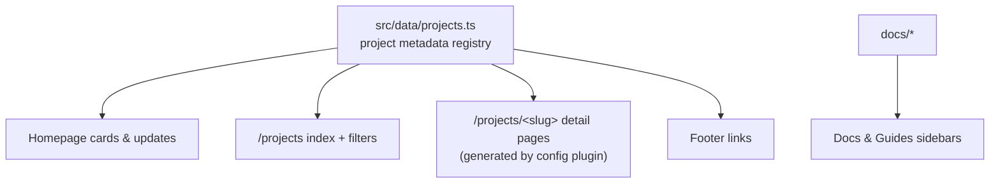

# Developer Guide

This site is a [Docusaurus](https://docusaurus.io) 3 project written in
TypeScript, with custom React components for the portfolio layer and standard
Docusaurus docs underneath. It builds with the Docusaurus 4 `future.v4`
compatibility flags enabled.

## Architecture



Everything portfolio-shaped renders from **one metadata registry**:
`src/data/projects.ts`. A small plugin in `docusaurus.config.ts` generates a
detail route for each entry, so project pages exist without any per-project
page files.

## Adding a project

Adding a project is a content task:

1. **Register it** — add an entry to `src/data/projects.ts` (name, slug,
   summary, category, status, URLs, technologies, accent color, features,
   getting-started steps, updates).
2. **Add artwork** — drop a 16:9 image at
   `static/img/projects/<slug>.svg` (or `.png`) and reference it in the
   entry's `screenshots`.
3. **Write docs** — create `docs/<slug>/` with at least `overview.md`,
   and add the category to `sidebars.ts`.

The homepage grid, projects index, detail page, and footer pick it up
automatically.

## Local development

```bash
npm install
npm run start      # dev server at localhost:3000
npm run typecheck  # TypeScript
npm run build      # production build (broken links fail the build)
```

## Conventions

- **Design tokens** live in `src/css/custom.css` as `--kk-*` custom
  properties; components consume tokens, never raw hex values.
- **CSS Modules** per component; no global component styles.
- **Dark is the signature theme**; both themes must remain readable.
- The production build treats broken links and anchors as errors — run
  `npm run build` before pushing.
