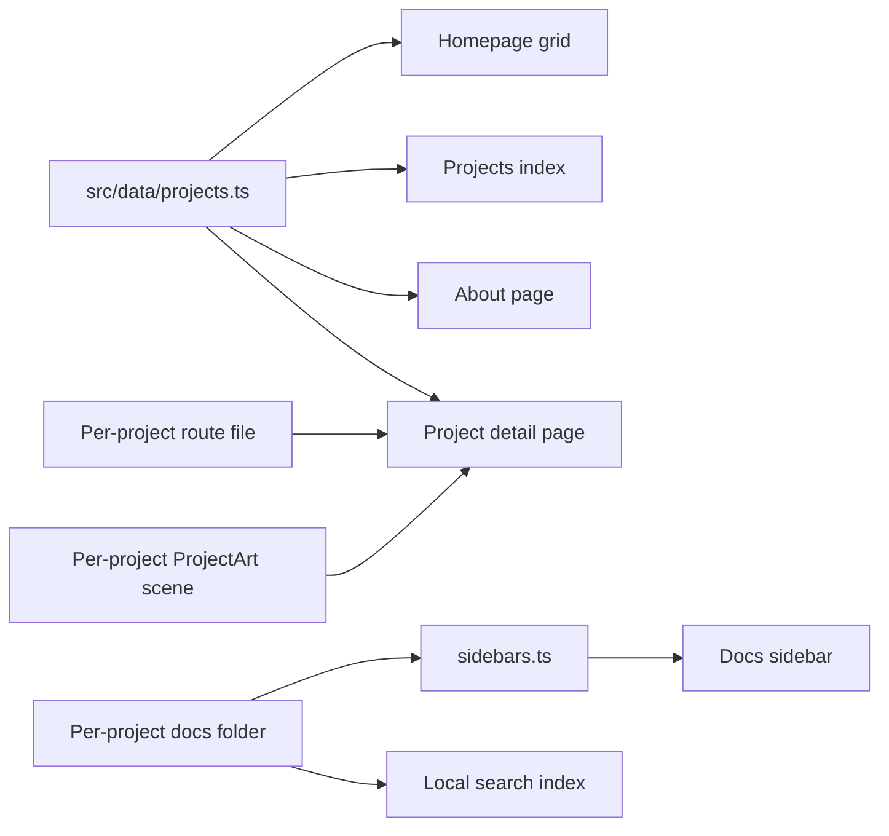

This site is a portfolio and a documentation hub in one codebase. Here's how
it's put together, and what it takes to add a project, which is deliberately
a small, contained task, mostly content and metadata, not a redesign.

## The stack

- **Docusaurus 3.10.2** with **TypeScript** and **React 19**, with the
  Docusaurus v4 future flags enabled so the eventual upgrade stays boring.
- **MDX** for all documentation content.
- **CSS Modules** for the portfolio components (homepage, project pages,
  and friends).
- **Design tokens as CSS custom properties**, extracted from
  [sqlclr.com](https://sqlclr.com) so the whole family shares one design
  language. Near-black surfaces, hairline borders, restrained blue accent.
- **Dark-first theme.** Dark is the default and the design target, not an
  afterthought.
- **Local search.** Fully client-side, no external search service.
- **Mermaid support** for diagrams in any doc, like the one below.

## How a project gets added

Six steps. Most of it is content and metadata; two small code files give the
project its page and its artwork.

1. **Add one entry to `src/data/projects.ts`.** One record with the
   project's `name`, `slug`, `summary`, `lede`, `category`, `status`,
   `liveUrl`, `launchLabel`, `docsPath`, `technologies`, `featured`,
   `accentColor`, `studio`, `highlights`, `gettingStarted`, and `updates`
   (with `inGameTitle` and `repositoryUrl` optional). This single record
   drives the homepage grid, the projects index, the About page, and the
   content of the project detail page.
2. **Add the detail-page route at `src/pages/projects/<slug>.tsx`.** A short
   file that renders `<ProjectPage slug="<slug>" />`. The `ProjectPage`
   component is generic and reads everything from the metadata; this file
   just gives the project its URL.
3. **Add a `ProjectArt` scene in `src/components/ProjectArt/index.tsx`.** A
   self-contained SVG keyed by the slug, used on the card and the hero.
   Without one, the art frame renders empty.
4. **Create `docs/<slug>/` with the page set.** An overview (the entry
   point), a how-to-play or quick-start, a gameplay or concepts page, tips,
   an FAQ, and a changelog.
5. **Register the sidebar group in `sidebars.ts`** so the new section
   appears in the docs navigation.
6. **Update the spots that count the projects by hand.** A few places
   hardcode the total: the homepage terminal comment
   (`src/pages/index.tsx`), the projects-index lede
   (`src/pages/projects/index.tsx`), and the docs landing and
   getting-started pages (`docs/index.md`, `docs/getting-started.md`). The
   cross-project [How to Play](./how-to-play.md) guide also lists the games.
   Grep for the current count word and bump it.

After that, the homepage grid, the projects index, and the About page pick
the new project up from the metadata automatically.

## How content flows

One metadata file feeds most of the portfolio, with a small route file and an
SVG scene giving each project its own page and artwork; the docs folder feeds
the sidebar and the search index. A project isn't finished until both sides
know about it.

## Conventions worth keeping

- Every project's docs section leads with an `overview` page; it's the
  canonical link target from the landing page and the portfolio.
- Docs link to each other with relative links, and to portfolio pages with
  absolute paths like [Projects](/projects).
- Live site URLs are always written absolute.
- Each project brings its own accent color (Lisetris is neon pink,
  Spindrift is vector white), but everything sits on the shared dark
  palette.
