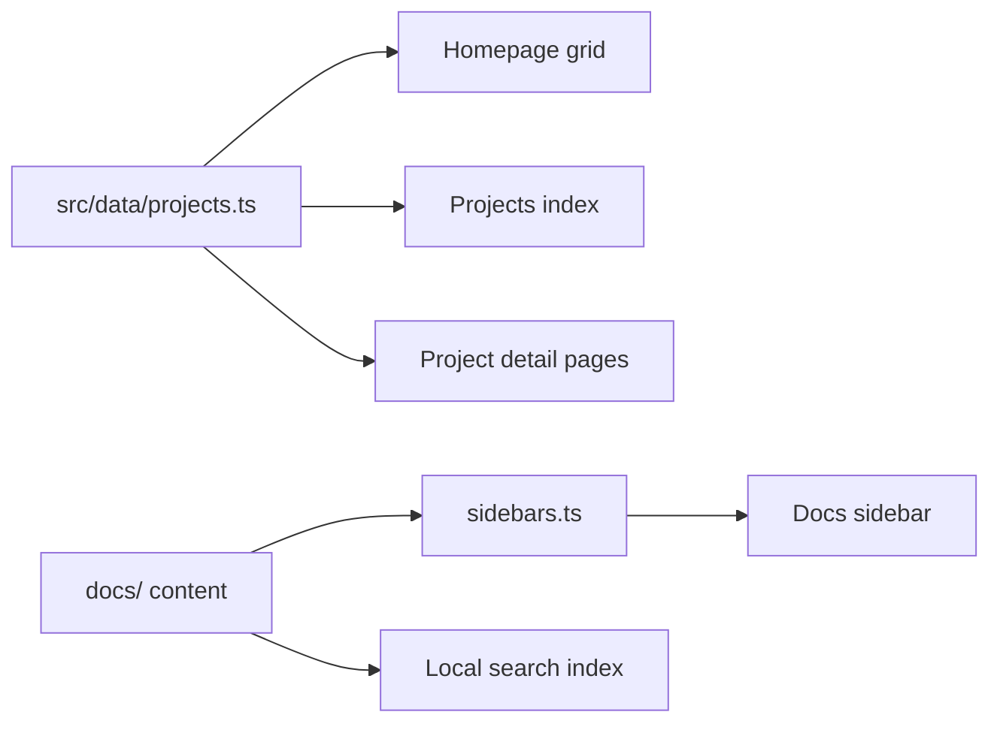

This site is a portfolio and a documentation hub in one codebase. Here's how
it's put together, and what it takes to add a project, which is deliberately
a content task, not a redesign.

## The stack

- **Docusaurus 3.10.2** with **TypeScript** and **React 19**, with the
  Docusaurus v4 future flags enabled so the eventual upgrade stays boring.
- **MDX** for all documentation content.
- **CSS Modules** for the portfolio components (homepage, project pages,
  and friends).
- **Design tokens as CSS custom properties**, extracted from
  [sqlclr.com](https://sqlclr.com) so the whole family shares one design
  language. Near-black surfaces, hairline borders, restrained blue accent.
- **Dark-first theme.** Dark is the default and the design target, not an
  afterthought.
- **Local search.** Fully client-side, no external search service.
- **Mermaid support** for diagrams in any doc, like the one below.

## How a project gets added

Four steps, all content and metadata:

1. **Add one entry to `src/data/projects.ts`** with `name`, `slug`, `summary`,
   `category`, `status`, `liveUrl`, `technologies`, and `accent`. This
   single record drives everything the portfolio side shows.
2. **Create `docs/<slug>/` with the minimum page set.** An overview (the
   entry point), a how-to-play or quick-start, a gameplay or concepts page,
   tips, an FAQ, and a changelog.
3. **Register the sidebar group in `sidebars.ts`** so the new section
   appears in the docs navigation.
4. **Done.** The homepage grid, the projects index, and the project detail
   page all pick the new project up from the metadata automatically. No
   component edits, no hand-built routes.

## How content flows

One metadata file feeds the portfolio; the docs folder feeds the sidebar and
the search index. A project isn't finished until both sides know about it.

## Conventions worth keeping

- Every project's docs section leads with an `overview` page; it's the
  canonical link target from the landing page and the portfolio.
- Docs link to each other with relative links, and to portfolio pages with
  absolute paths like [Projects](/projects).
- Live site URLs are always written absolute.
- Each project brings its own accent color (Lisetris is neon pink,
  Spindrift is vector white), but everything sits on the shared dark
  palette.
