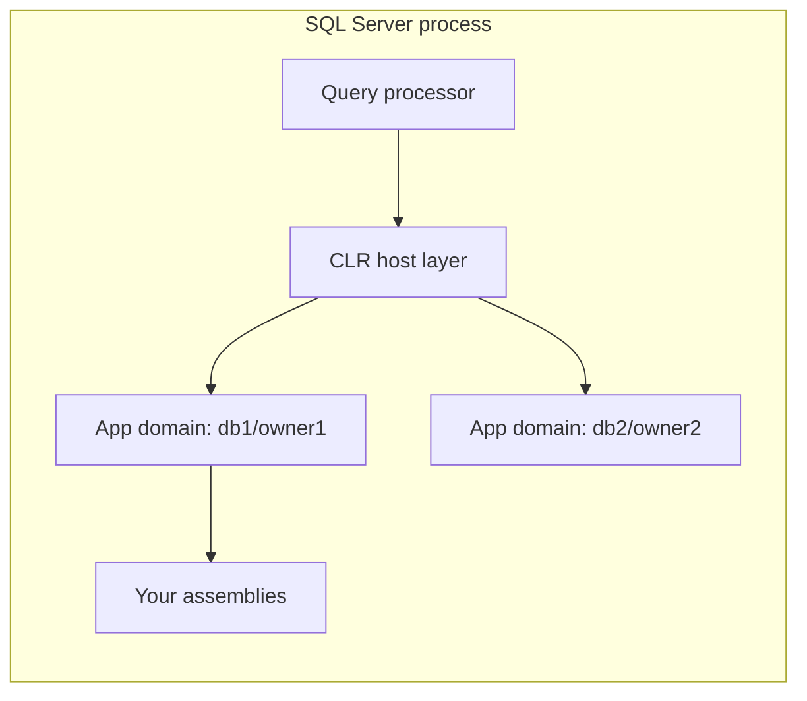

# Core Concepts

## The hosted CLR

SQL Server loads the .NET Framework CLR **in-process** and acts as its host:
it controls memory allocation, thread scheduling, and escalation policy. That
means CLR code competes with the buffer pool and query workspace for memory,
and a misbehaving assembly can be throttled or its app domain unloaded by the
engine rather than taking the server down.



## Assemblies

An assembly is registered per database with `CREATE ASSEMBLY`, which copies
the DLL bytes **into the database** — the file on disk is only read once.
Backups therefore include your CLR code, and restores bring it along.

Key catalog views:

- `sys.assemblies` — what's registered
- `sys.assembly_files` — the stored bytes
- `sys.assembly_modules` — which SQL objects bind to which methods

## The type boundary

Parameters and return values cross between SQL and .NET types. Use the
`System.Data.SqlTypes` structs (`SqlString`, `SqlInt32`, `SqlBoolean`, …)
rather than raw CLR types: they carry NULL semantics correctly.

| SQL Server | SqlTypes | CLR |
|---|---|---|
| `NVARCHAR` | `SqlString` | `string` |
| `INT` | `SqlInt32` | `int` |
| `BIT` | `SqlBoolean` | `bool` |
| `DATETIME2` | — | `DateTime` |
| `VARBINARY` | `SqlBytes` | `byte[]` |

Always check `IsNull` before touching `.Value`.

## The context connection

Inside CLR code you can query the hosting session directly:

```csharp
using (var conn = new SqlConnection("context connection=true"))
{
    conn.Open();
    // Runs in the caller's transaction and security context.
}
```

The context connection is fast (in-process, no protocol hop) but limited to
one open instance and the current session's context.

## Function attributes that matter

- `IsDeterministic` — required for use in indexed computed columns
- `IsPrecise` — no floating-point imprecision
- `DataAccess = DataAccessKind.Read` — declare if the function reads data
- `SystemDataAccess` — declare if it reads system catalogs

Declaring these accurately is not optional politeness; the optimizer and
indexability rules rely on them.
