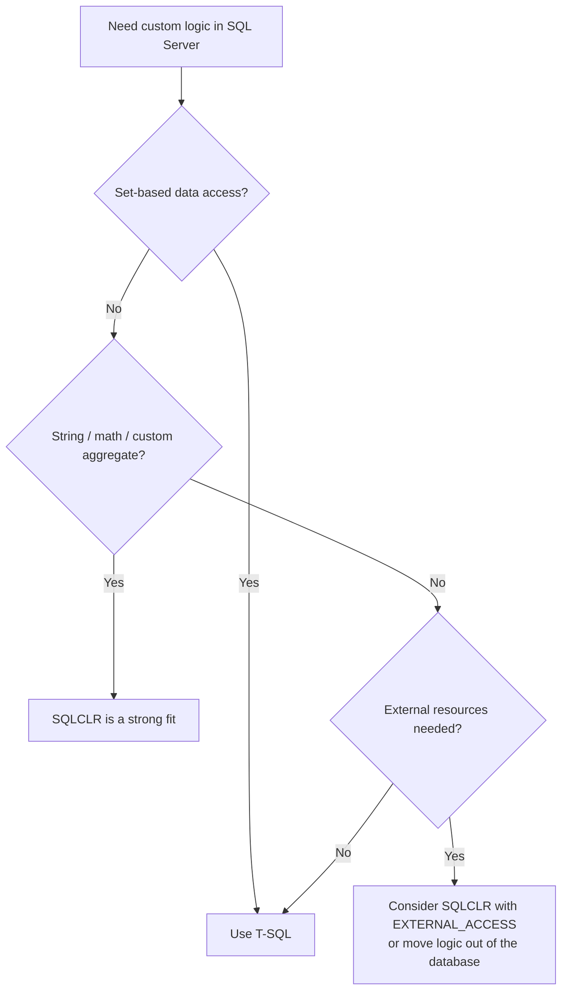

# SQLCLR Overview

**SQLCLR** is a developer resource for SQL Server CLR integration — the
engine feature that hosts the .NET Common Language Runtime *inside*
SQL Server, letting you write database objects in C# (or any .NET language)
instead of T-SQL.

The live site is at [sqlclr.com](https://sqlclr.com).

## What CLR integration gives you

With CLR integration you can implement the following as compiled .NET code:

- **Scalar functions** — string manipulation, regex, hashing, math that T-SQL
  handles poorly or slowly
- **Table-valued functions** — stream rows from any .NET-accessible source
- **Stored procedures** — procedural logic with real data structures
- **User-defined aggregates** — custom aggregations (median, concatenation,
  statistical functions) that run in a single pass
- **User-defined types** — structured values with behavior

## When to use it (and when not to)

CLR shines for **compute-heavy, row-by-row work**: parsing, regular
expressions, custom aggregation, and algorithms that are awkward in set-based
T-SQL. It is the wrong tool for ordinary data access — plain T-SQL almost
always wins when the work is set-based.

## Where to go next

- [Quick Start](/docs/sqlclr/quick-start) — deploy your first CLR function in
  minutes
- [Installation](/docs/sqlclr/installation) — enable CLR integration properly
- [Core Concepts](/docs/sqlclr/core-concepts) — assemblies, permission sets,
  and hosting
- [Security](/docs/sqlclr/security) — signing, `TRUSTWORTHY`, and "CLR strict
  security"
